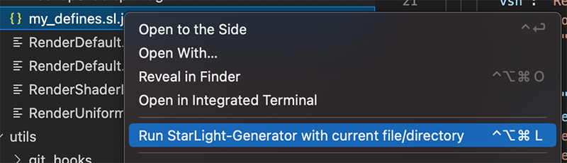

# vscode-starlight-generator

A vscode plugin for [starlight](https://starlight.yyyyy.tech) service. Enjoy it!

## Features

- Generate `Starlight Shader Template` with single click

## Install

- Search `StarLight-Generator` in the Visual Studio Store.
- Get it at <https://marketplace.visualstudio.com/items?itemName=wysaid.starlight-generator>

## Extension Settings

You can define some options like below:

```jsonc
{
    "starlight-generator.binary_path": "", //< The path to starlight binrary. (Optional, maybe faster than online service)
    "starlight-generator.api_url":"", //< The url to starlight service (default: https://starlight.yyyyy.tech)
    "starlight-generator.showEditorContextMenu": true, // Show 'StarLight-Generator' in editor context menu
    "starlight-generator.explorerContextMenu": true, // Show 'StarLight-Generator' in explorer context menu
}
```

## Key Bindings

```jsonc
{
    "key" : "ctrl+cmd+alt+l",
    "command" : "starlight-generator.generate"
}
```

Press <kbd>ctlr+cmd+alt+l</kbd> to trigger Starlight-Generator with currently active file/folder.

## Context Menu

Just right clicking on the file explorer or the currently opened file in the editor.



---

## StarLight Server API Explain

### Single Request

| args (post)     | type      | comment                                                |
| --------------- | --------- | ------------------------------------------------------ |
| vert            | text file | vertex shader file                                     |
| frag            | text file | fragment shader file                                   |
| vert_file_name  | string    | the output vertex shader file name                     |
| frag_file_name  | string    | the output fragment shader file name                   |
| vert_class_name | string    | the output fragment shader class name                  |
| frag_class_name | string    | the output vertex shader class name                    |
| namespace       | string    | the output namespace                                   |
| stage           | string    | output stages, must be one of `vert`, `frag` or `both` |
| type            | string    | output form, must be one of `lua`, `js` or `cpp`             |
| debug           | string    | debug mode. this will get the log of request actions.  |

### Batch Request

| args (post) | type        | comment                                                                                                           |
| ----------- | ----------- | ----------------------------------------------------------------------------------------------------------------- |
| zipfile     | zipped file | A zipfile with starlight standard template <br>support `include` method with root dir and `${zipdir}/include` dir |
| stage       | string      | output stages, must be one of `vert`, `frag` or `both`                                                            |
| debug       | string      | debug mode. this will get the log of request actions.                                                             |
